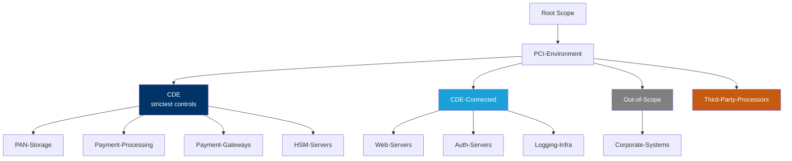
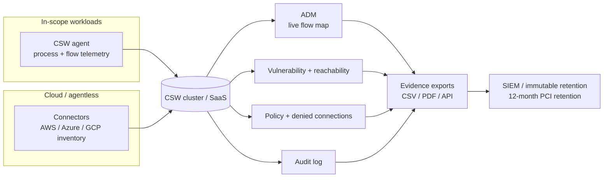
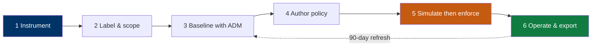

# Cisco Secure Workload — PCI DSS v4.0 Reference Design

**Version:** 1.0  ·  **Standard:** PCI DSS v4.0 (March 2022)  ·  **Platform:** Cisco Secure Workload 4.0

> **How to use this document.** This is the engineering blueprint for building CSW so a Cardholder Data Environment (CDE) is isolated and continuously produces QSA-ready evidence. Read Sections 1–2 to design and build; Section 3 requirement-by-requirement; Sections 4–6 to operate, run a POV, and understand the boundaries.

---

## Contents

1. [Reference architecture](#1-reference-architecture)
2. [The 6-step CSW build](#2-the-6-step-csw-build)
3. [Requirement-by-requirement implementation](#3-requirement-by-requirement-implementation)
4. [Evidence package for the QSA](#4-evidence-package-for-the-qsa)
5. [POV / workshop approach](#5-pov--workshop-approach)
6. [What CSW does not cover](#6-what-csw-does-not-cover)
7. [CSW primer (new to the platform?)](#7-csw-primer--new-to-the-platform)

---

## Reader's guide

**Who this is for.** Merchants and service providers with a defined CDE preparing for a QSA assessment, AOC, or self-assessment under PCI DSS v4.0 — and the SEs / platform engineers who build the environment. QSAs can use it to cross-check the technical form of the evidence.

**Questions this design answers:**

- *Can I prove every component "in scope" for PCI is actually in scope today, with no drift since last assessment?* (Req 12.5.2)
- *Req 1.2.1 wants a current network diagram of CDE flows — what is the live, machine-generated version of that diagram?*
- *Req 11.5.2 (change detection) — what tells me nothing was added to the CDE between assessments?*
- *Req 10.2 logging — am I capturing audit-relevant events at the workload tier, not only at the network/SIEM layer?*
- *v4.0 uses "in place and operating effectively" language — what does my continuous evidence story look like vs. annual snapshots?* (Req 12.4.2)

**What you'll need.** A defined and documented CDE, your current PCI scope document, and your QSA's evidence-request template (or last year's RoC sections).

---

## 1. Reference architecture

### 1.1 Scope hierarchy

Model the CDE as a CSW **scope tree**. Scope membership is driven by **labels**, so it updates automatically as workloads appear or move — this is how you fight scope drift.



### 1.2 Data-flow and evidence pipeline



**Design principles**

- **Label-driven scope** (`compliance:pci`, `data:chd`, `env:prod`) so membership is queryable and self-maintaining.
- **Default-deny** inside the CDE; every allow is explicit, documented, and logged.
- **Simulation before enforcement** so every blocking rule has change-board evidence.
- **Export on a cadence** to immutable storage — the exports *are* the evidence, not screenshots taken during the audit week.

---

## 2. The 6-step CSW build

This is the end-to-end path from "CSW installed" to "QSA-ready evidence." Steps 1–4 stand it up; 5–6 keep it compliant.



### Step 1 — Instrument every in-scope workload
- Deploy CSW agents to all CDE and CDE-connected servers/VMs/containers; add cloud **connectors** for agentless inventory.
- **Exit criteria:** in-scope host list reconciled to CSW Inventory at 100% (or documented, justified exceptions).
- **Evidence produced:** inventory CSV + agent-status export.

### Step 2 — Label and build the scope tree
- Apply labels: `compliance:pci`, `data:chd`, `env:prod|nonprod`, `app:<name>`, `owner:<team>`.
- Build the scope tree from §1.1 using label queries so membership is automatic.
- **Exit criteria:** every in-scope workload resolves into exactly one CDE / CDE-connected / out-of-scope scope.
- **Evidence produced:** scope-membership snapshot (addresses Req 12.5.2 scope accuracy).

### Step 3 — Baseline with ADM
- Run **Application Dependency Mapping** on the PCI scope for a full business cycle (**≥ 2 weeks**; longer across month-end).
- Review clusters with application owners; document unexpected flows (shadow IT, vendor egress, scope creep).
- **Exit criteria:** app owners sign off the cluster-to-application mapping.
- **Evidence produced:** the **live CDE flow map** (Req 1.2.1) + flow samples with process context.

### Step 4 — Author policy (default-deny, allowlist)
- Import ADM-discovered flows into a workspace; set the CDE posture to **default-deny**.
- Make every permitted path explicit (see §3, Req 1). Keep an **exception register** for anything that cannot be tightened yet.
- **Exit criteria:** policy reviewed and approved by the application owner + security.
- **Evidence produced:** policy export + exception register.

### Step 5 — Simulate, then enforce
- Run the policy in **Simulation** mode **≥ 1 week**. Every "would-be-denied" flow becomes a change ticket, not an outage.
- Resolve false positives, then **enforce** on the CDE scope. Record a negative test in **Denied Connections**.
- **Exit criteria:** zero unexplained would-denies; enforcement live on the CDE.
- **Evidence produced:** simulation report + enforcement screenshot + a logged denied connection (proof the control *operates*).

### Step 6 — Operate and export on a cadence
- Quarterly **evidence pack**: inventory, policy, denied connections, vulnerabilities, audit log.
- Refresh **ADM every 90 days**; verify SIEM integration with sample events; re-run scope reconciliation.
- **Exit criteria:** a repeatable quarterly binder your QSA can consume without a live walkthrough.
- **Evidence produced:** the full quarterly binder (see [Evidence Checklist](docs/evidence-checklist.md)).

---

## 3. Requirement-by-requirement implementation

> **Coverage legend**
> - 🟢 **Direct** — CSW produces the primary evidence artifact.
> - 🟠 **Supporting** — CSW produces an input that feeds/complements another control.
> - ⚪ **Evidence Required** *(supplied outside CSW)* — CSW produces nothing for this item; it is in scope for compliance but out of scope for CSW, so the customer evidences it via another control, tool, or process (key management/HSM, physical access, HR/training, vendor contracts, ASV scans). A **scope boundary, not a gap or failure** — and not "unsupported."

### Requirement 1 — Network Security Controls  🟢

**1.2.1 — Configuration standards for network controls.** Express the CDE as enforced policy:

```
Policy: CDE-Isolation (default-deny)
  DENY  Any            -> CDE                 (default deny all inbound)
  ALLOW Web-Servers    -> Payment-Processing  (tcp/443 only)
  ALLOW Payment-Proc   -> PAN-Storage         (tcp/5432|1521, encrypted)
  ALLOW Auth-Servers   -> CDE                 (tcp/636 LDAPS only)
  DENY  CDE            -> Internet             (no direct egress)
  LOG   all violations with full 5-tuple + process context
```

- **1.3.1 / 1.3.2** — allowlist-only inbound to the CDE; CDE workloads blocked from initiating internet egress. Any unlisted source attempting CDE access alerts immediately.
- **1.4.1** — micro-segmentation enforces at the **workload** level, not just the perimeter; ADM continuously maps CDE communication paths.
- **Evidence:** ADM flow map · enforced policy export · denied-connections log.

### Requirement 2 — Secure Configurations  🟠
- CSW process monitoring surfaces unexpected processes/services on CDE workloads; vulnerability data flags insecure components.
- **Evidence (supporting):** process inventory + vuln export feeding your hardening/CIS-benchmark programme.

### Requirement 6 — Vulnerability Management  🟢

**6.3.3 — Protect from known vulnerabilities.**
```
CSW → Investigate → Vulnerability Report
  Scope: CDE  ·  Filter: CVSS ≥ 4.0  ·  Export: CSV
Remediation SLAs (example):
  Critical (9.0+): 24h   High (7.0–8.9): 7d   Medium (4.0–6.9): 30d
```
- CSW adds **reachability** context (is the vulnerable component actually exposed on an allowed path?) so remediation is risk-ranked, not just CVSS-ranked.
- **6.4.1** — inbound flows to web-facing CDE workloads are monitored; anomalous patterns surface via forensic telemetry.
- **Evidence:** CVSS-ranked vulnerability export with reachability.

### Requirement 7 — Access Control (workload tier)  🟢
- **7.2.1** — scope-based policy: only approved workload identities reach the CDE; catches gaps beneath/between network-control views (complements, does not replace, PCI network controls).
- **7.2.5** — process monitoring alerts on new process hashes not seen in the ADM baseline.
- **Evidence:** scope-based allowlist export · process audit log.

### Requirement 10 — Logging & Monitoring  🟢

**10.2.1 — Capture required events** (per CDE workload): all inbound/outbound connections (5-tuple), process activity (name, hash, parent, user), policy violations, and anomaly events.

- **10.3.1** — telemetry held in tamper-resistant cluster storage; export pipeline to immutable SIEM/SYSLOG for the PCI 12-month retention (3 months immediately available).
- **10.4.1** — daily CDE event summary; automated export to SOC/SIEM removes the manual-review burden.
- **Evidence:** flow + process telemetry · policy-violation report · retention pipeline config.

### Requirement 11 — Security Testing  🟠
- **11.3.1** — CSW provides continuous vulnerability-exposure context; use as **supplementary** evidence — it does **not** replace required ASV external scans unless your QSA accepts it for a documented customized approach.
- **11.4.1** — ADM baseline is the pre-pentest reference; a post-pentest ADM diff detects any new paths; forensic telemetry captures all test activity.
- **11.5.2** — baseline deviation detection is your change-detection signal for the CDE.
- **Evidence (supporting):** ADM baseline-deviation report · pre/post-pentest flow diff.

### v4.0 — specific additions CSW helps with

| New in v4.0 | CSW response | Coverage |
|---|---|:--:|
| 12.3.2 — targeted risk analysis per requirement | Vulnerability + ADM data feed the analysis | 🟠 |
| 1.2.1 — all traffic flows documented and approved | ADM produces observed-flow documentation for instrumented paths (human approval + non-CSW paths remain in CDE docs) | 🟢 |
| 6.3.3 — vulnerabilities addressed per risk ranking | Continuous CVSS + reachability-ranked remediation inputs | 🟢 |
| 10.7.2 — failures of critical controls detected | Sensor-offline alerts + enforcement-gap detection | 🟢 |

---

## 4. Evidence package for the QSA

| Evidence item | CSW source | PCI requirement | Cadence |
|---|---|---|---|
| CDE network policy export | Defend → Policy Workspaces | Req 1 | Per assessment |
| CDE inbound/outbound flow log | Investigate → Flow Search | Req 1, 10 | Continuous |
| Policy-violation report | Alerts → Triggered Events | Req 10 | Monthly |
| Vulnerability + reachability report (CDE) | Investigate → Vulnerability | Req 6, 11 | Weekly |
| CDE scope-membership snapshot | Inventory → Export | Req 1, 7, 12.5.2 | Monthly |
| Anomaly / baseline-deviation log | Alerts → Dashboard | Req 10, 11 | Monthly |
| ADM dependency map (CDE) | Investigate → ADM | Req 1 | Quarterly |
| Process audit log (CDE) | Investigate → Process Search | Req 10 | On-demand |

Full export locations and a printable worklist: **[Evidence Checklist](docs/evidence-checklist.md)**.

---

## 5. POV / workshop approach

Run a scoped proof-of-value before an estate-wide rollout. The full day-by-day plan is in **[docs/pov-plan.md](docs/pov-plan.md)**. Summary:

1. Confirm PCI version and assessment cycle with the compliance team.
2. Pick **one** CDE boundary or payment service — do not instrument the whole estate.
3. Instrument + label; document the cannot-instrument register (itself evidence).
4. Observe flows ≥ 2 weeks; generate ADM; app-owner signoff.
5. Author policy; run Simulation ≥ 1 week before any enforcement.
6. Package inventory, scope, flows, policy, exceptions, and gaps as the evidence output; cross-reference the QSA's work-papers.

---

## 6. What CSW does not cover

> These are the ⚪ **Evidence Required** items from §3 — in scope for compliance but **out of scope for CSW**. They are **not** product gaps or unsupported controls; the evidence simply comes from another control, tool, or process, and the customer owns it.

CSW addresses the **workload-resident** slice: segmentation, flows, process context, vulnerability reachability, and change drift. It does **not** produce evidence for, and does not replace:

- Cryptography and key management (Reqs 3, 4) — HSM/KMS and crypto programme.
- Physical access (Req 9) and HR/training records (Req 12).
- Authentication/identity lifecycle (Req 8) beyond workload-tier access.
- Signed vendor/TPP contracts and AOCs, formal ASV scans, and QSA attestation.

CSW evidence is an **input** to these programmes, never the attestation itself.

---

## 7. CSW primer — new to the platform?

Cisco Secure Workload (CSW) is a **workload-protection platform**. A lightweight **agent** on each server/VM/container observes processes and network flows; **cloud connectors** add AWS/Azure/GCP inventory where agents are not deployed.

| CSW term | Meaning | Why PCI teams care |
|---|---|---|
| **Scope** | Logical boundary (CDE, CDE-connected) | Defines the systems you must prove are isolated |
| **Label / filter** | Tag or query assigning workloads to scopes | Automates membership — reduces scope drift |
| **ADM** | Application Dependency Mapping from observed traffic | **Live** CDE flow diagram for assessors (Req 1.2.1) |
| **Workspace** | Policy container for one scope/application | Where allow/deny rules are authored |
| **Monitor → Simulation → Enforce** | Safe rollout sequence | Simulation = change-board evidence before blocking |
| **Denied Connections** | Log of flows blocked by policy | Primary proof enforcement **operates** (Req 10) |

**Console areas:** Investigate (inventory, flows, vulns) · Defend / Segmentation (policy) · Manage (agents) · Platform (connectors) · Administration (audit log).

---

## Related frameworks

- **ISO/IEC 27001:2022** — most PCI-attested organisations also run an ISO 27001 ISMS.
- **NIST SP 800-53 Rev 5** — when PCI evidence is reused across a federal control programme.
- **DORA (EU 2022/2554)** — EU payment-services entities share substantial PCI ↔ DORA Pillar 1 evidence.
- **NIST SP 800-207** — the zero-trust segmentation pattern underneath PCI Reqs 1, 7, 11.

See the umbrella index: [CSW-Compliance-Mapping](https://github.com/chandrapati/CSW-Compliance-Reference-Designs).

---

*This reference design is for informational and planning purposes. It is not legal, regulatory, audit, or certification advice and is not a PCI attestation. Validate all requirement references against the current official PCI DSS v4.0 text, your environment, and your QSA. Replace bracketed fields before customer delivery.*
