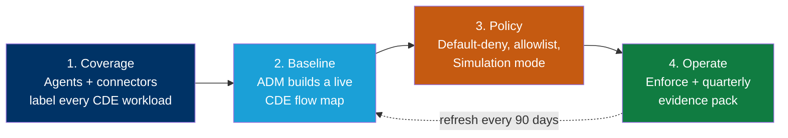
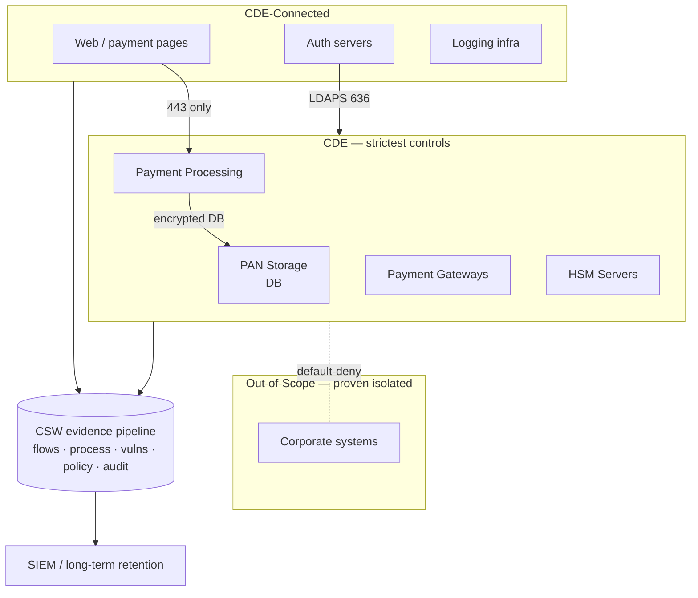

# Cisco Secure Workload — PCI DSS v4.0 Reference Design

> A step-by-step blueprint for building **Cisco Secure Workload (CSW)** so a merchant or service provider can **isolate its Cardholder Data Environment (CDE)** and **produce the machine-generated evidence** a QSA expects under PCI DSS v4.0 — segmentation, live flow maps, vulnerability reachability, logging, and change-drift detection.

CSW does **not** certify PCI compliance. It turns workload communication, process activity, and inventory into **evidence** that your team, your compliance function, and your QSA can review. This repo shows how to stand that evidence up and keep it current between assessments.

---

## What's in this repo

| Document | For | Use it to |
|---|---|---|
| **[Reference Design](CSW-PCI-DSS-Reference-Design.md)** | SE / platform / security engineering | Build CSW end-to-end: architecture, scopes, labels, ADM, enforcement, per-requirement evidence |
| **[Compliance Report (PDF)](CSW-PCI-DSS-Compliance-Report.pdf)** · [DOCX](CSW-PCI-DSS-Compliance-Report.docx) | Compliance team, QSA, exec | Customer-facing coverage mapping (color-coded Direct / Supporting / Evidence Required) |
| **[Evidence Checklist](docs/evidence-checklist.md)** | Evidence owner | A printable, per-requirement "what to export, from where, how often" worklist |
| **[POV / Workshop Plan](docs/pov-plan.md)** | SE + customer | Run a 45-day proof-of-value on one CDE boundary |

---

## How CSW produces PCI evidence — the big picture

Each phase produces a specific, exportable artifact. The **[Reference Design](CSW-PCI-DSS-Reference-Design.md)** maps every artifact to a PCI requirement.

---

## Reference architecture at a glance

`default-deny` between CDE and out-of-scope is what lets you *prove* scope reduction to a QSA — not a claim, a logged, enforced fact.

---

## Coverage snapshot

CSW produces **direct** evidence for the workload-resident slice of PCI and **supporting** inputs elsewhere. It never replaces your QSA's judgement.

| PCI requirement area | CSW coverage | Primary CSW evidence |
|---|:--:|---|
| Req 1 — Network security controls / segmentation | 🟢 Direct | ADM flow map, enforced policy, denied connections |
| Req 6 — Vulnerability management | 🟢 Direct | CVE + reachability report, CVSS-ranked |
| Req 7 — Access control (workload tier) | 🟢 Direct | Scope-based allowlist, process audit |
| Req 10 — Logging & monitoring | 🟢 Direct | Flow + process telemetry, policy-violation log |
| Req 11 — Security testing | 🟠 Supporting | ADM baseline-deviation, pre/post-pentest diff |
| Req 2 — Secure configuration | 🟠 Supporting | Process/vuln signals feed hardening evidence |
| Reqs 3/4/8/9/12 (crypto, physical, policy, HR) | ⚪ Evidence Required | Supplied by other controls / processes |

> Coverage describes what evidence CSW produces — **not** that a control is passed.

---

## Start here

1. Read the **[Reference Design](CSW-PCI-DSS-Reference-Design.md)** — Sections 1–2 (architecture + the 6-step build).
2. Confirm your **CDE scope** with your compliance team and QSA.
3. Run the **[POV plan](docs/pov-plan.md)** on one CDE boundary.
4. Track exports with the **[Evidence Checklist](docs/evidence-checklist.md)**.
5. Share the **[Compliance Report](CSW-PCI-DSS-Compliance-Report.pdf)** with your assessor.

---

## Disclaimer

This repository is for informational and planning purposes. It is **not** legal, regulatory, audit, or certification advice, and it is **not** a PCI attestation. Validate all requirement references against the current official [PCI DSS v4.0](https://www.pcisecuritystandards.org/) text, your environment, and your QSA. Replace any bracketed fields before customer delivery.

*Part of the Cisco Secure Workload compliance reference-design series. Umbrella index: [CSW-Compliance-Mapping](https://github.com/chandrapati/CSW-Compliance-Mapping).*
